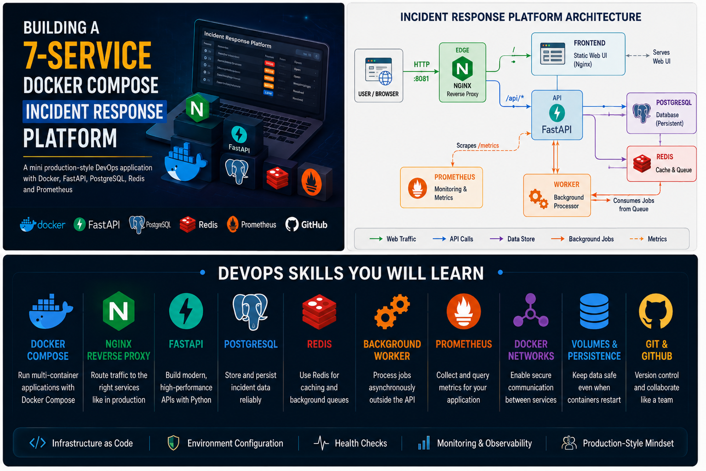
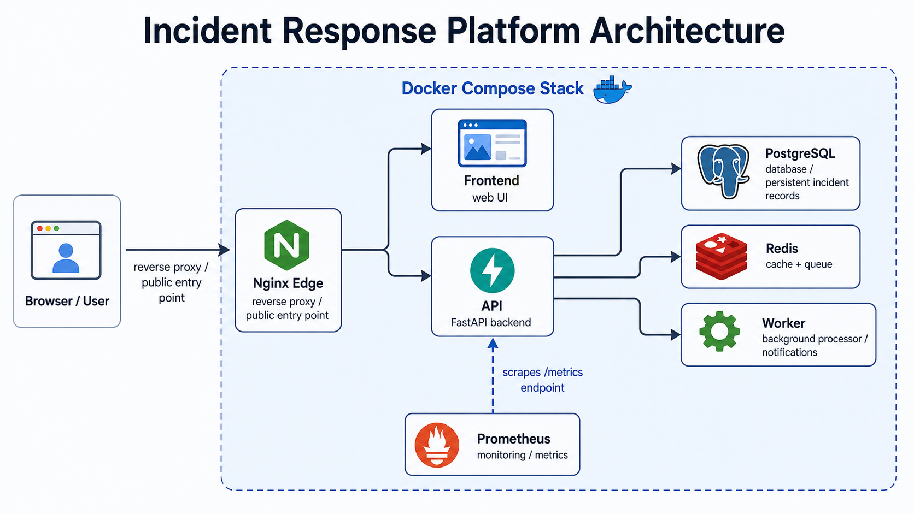
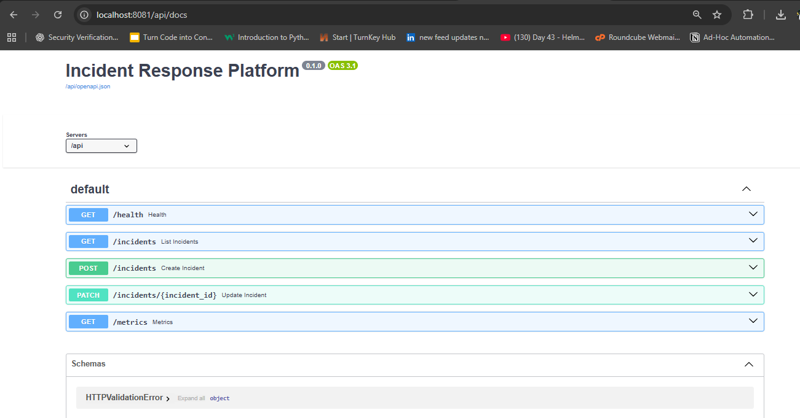
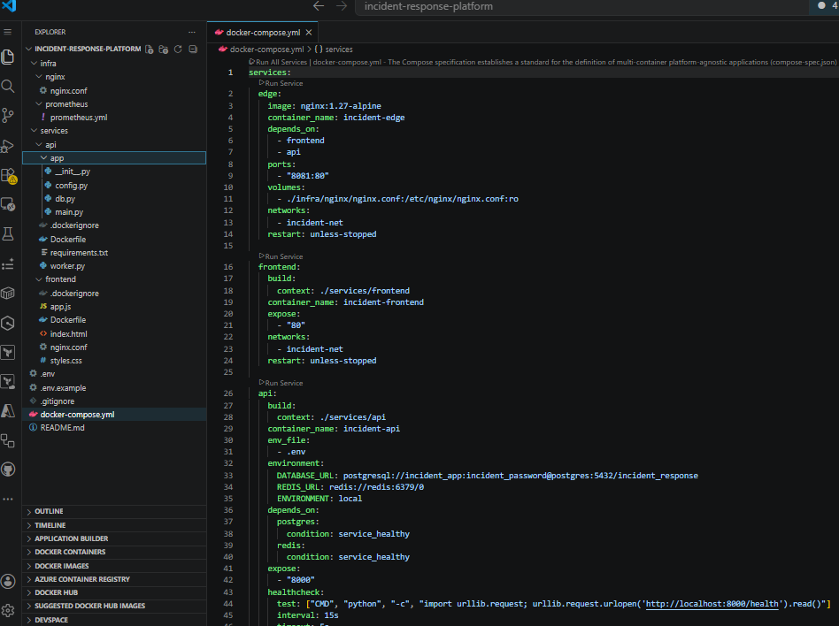

# Incident Response Platform


A seven-service Docker Compose application that models a production-style incident response workflow for DevOps, SRE, and platform engineering teams.



## Overview

This project demonstrates how to run a small but realistic operations platform with Docker Compose. It includes a browser-based incident console, a FastAPI backend, asynchronous background processing, durable storage, caching, reverse proxy routing, health checks, and Prometheus metrics.

The platform helps teams capture and manage operational incidents such as API latency, failed deployments, service outages, and database issues.

## Architecture



```text
Browser
  -> Nginx edge service
    -> Frontend web UI
    -> FastAPI backend
      -> PostgreSQL
      -> Redis
        -> Worker
      -> Prometheus metrics endpoint
```

## Services

| Service | Technology | Purpose |
| --- | --- | --- |
| `edge` | Nginx | Public reverse proxy on port `8081`; routes UI and API traffic. |
| `frontend` | Nginx static site | Browser UI for creating, acknowledging, and resolving incidents. |
| `api` | FastAPI | Validates requests, stores incidents, exposes health checks and metrics. |
| `worker` | Python | Processes queued incident jobs asynchronously. |
| `postgres` | PostgreSQL 16 | Stores durable incident records. |
| `redis` | Redis 7 | Provides short-lived cache and background job queue. |
| `prometheus` | Prometheus | Scrapes API metrics for observability. |

## Features

- Seven-service Docker Compose stack
- Single public application entry point through Nginx
- FastAPI backend with automatic Swagger documentation
- PostgreSQL persistence with Docker volumes
- Redis-powered cache and background queue
- Worker service for asynchronous incident processing
- Prometheus-compatible metrics endpoint
- Health checks for API, PostgreSQL, and Redis
- Private Docker network for service-to-service communication
- GitHub-ready documentation and Dev.to article draft

## Quick Start

Clone the repository:

```bash
git clone https://github.com/Donhadley22/incident-response-platform.git
cd incident-response-platform
```

Create your local environment file:

```bash
cp .env.example .env
```

On Windows PowerShell:

```powershell
Copy-Item .env.example .env
```

Start the stack:

```bash
docker compose up --build
```

Open the application:

| URL | Purpose |
| --- | --- |
| http://localhost:8081 | Incident response web UI |
| http://localhost:8081/api/health | API health check |
| http://localhost:8081/api/docs | FastAPI Swagger documentation |
| http://localhost:9090 | Prometheus |

## Common Commands

Run in detached mode:

```bash
docker compose up -d --build
```

List services:

```bash
docker compose ps
```

View all logs:

```bash
docker compose logs -f
```

View API logs:

```bash
docker compose logs -f api
```

View worker logs:

```bash
docker compose logs -f worker
```

Stop the stack:

```bash
docker compose down
```

Stop the stack and remove local volumes:

```bash
docker compose down -v
```

## API Endpoints

| Method | Endpoint | Description |
| --- | --- | --- |
| `GET` | `/api/health` | Returns API health status. |
| `GET` | `/api/incidents` | Lists recent incidents. |
| `POST` | `/api/incidents` | Creates a new incident. |
| `PATCH` | `/api/incidents/{incident_id}` | Updates incident status. |
| `GET` | `/api/metrics` | Exposes Prometheus metrics. |



## Monitoring

Prometheus scrapes the API metrics endpoint inside the Docker network:

```text
http://api:8000/metrics
```

Example metrics:

```text
incidents_created_total
incidents_resolved_total
open_incidents
```

## Project Structure

```text
incident-response-platform
├── assets
│   └── devto-images
├── infra
│   ├── nginx
│   └── prometheus
├── services
│   ├── api
│   └── frontend
├── .env.example
├── docker-compose.yml
├── DEVTO_ARTICLE.md
└── README.md
```



## Why This Pattern Matters

This project uses the same ideas found in real production systems:

- Keep the public edge separate from internal services.
- Split UI, API, worker, database, cache, and monitoring responsibilities.
- Use health checks so orchestration can detect unhealthy services.
- Store state in volumes instead of container filesystems.
- Use background workers for tasks that should not block web requests.
- Expose metrics so systems can be observed, not guessed at.

## Blog Draft

The Dev.to article draft is included in [DEVTO_ARTICLE.md](./DEVTO_ARTICLE.md).

The article images are stored in [assets/devto-images](./assets/devto-images).

## Roadmap

- Add Grafana dashboards
- Add authentication and authorization
- Add Slack or Microsoft Teams notifications
- Add GitHub Actions CI/CD
- Add automated tests
- Add container image scanning
- Add Nginx rate limiting
- Add TLS support
- Deploy to a cloud environment

## License

This project is for DevOps learning, tutorials, and portfolio demonstration.
